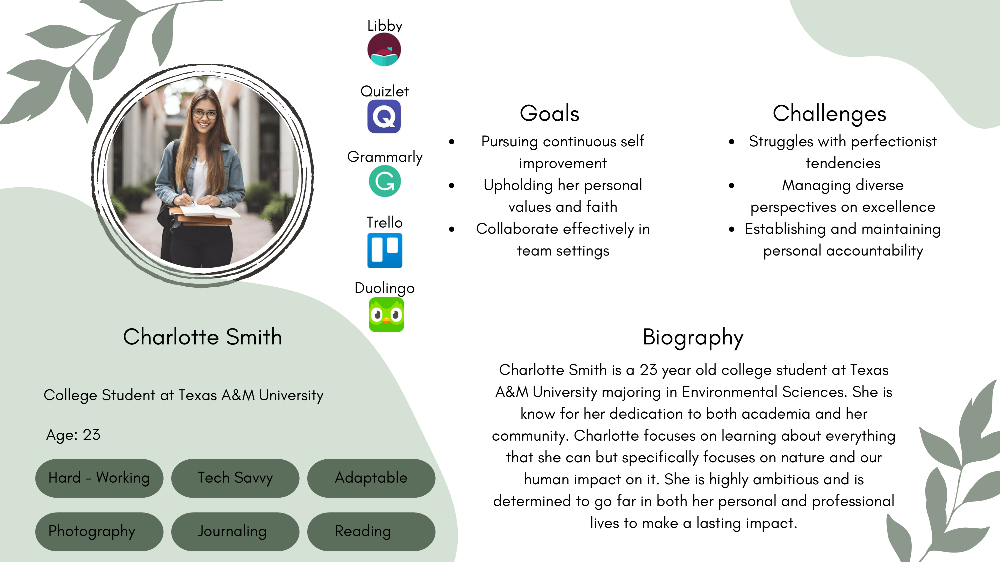
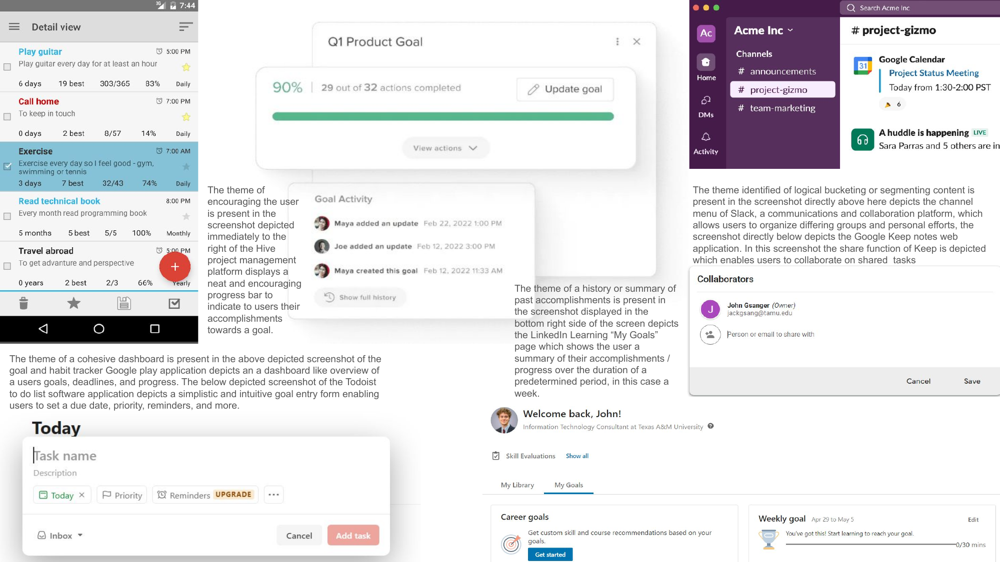
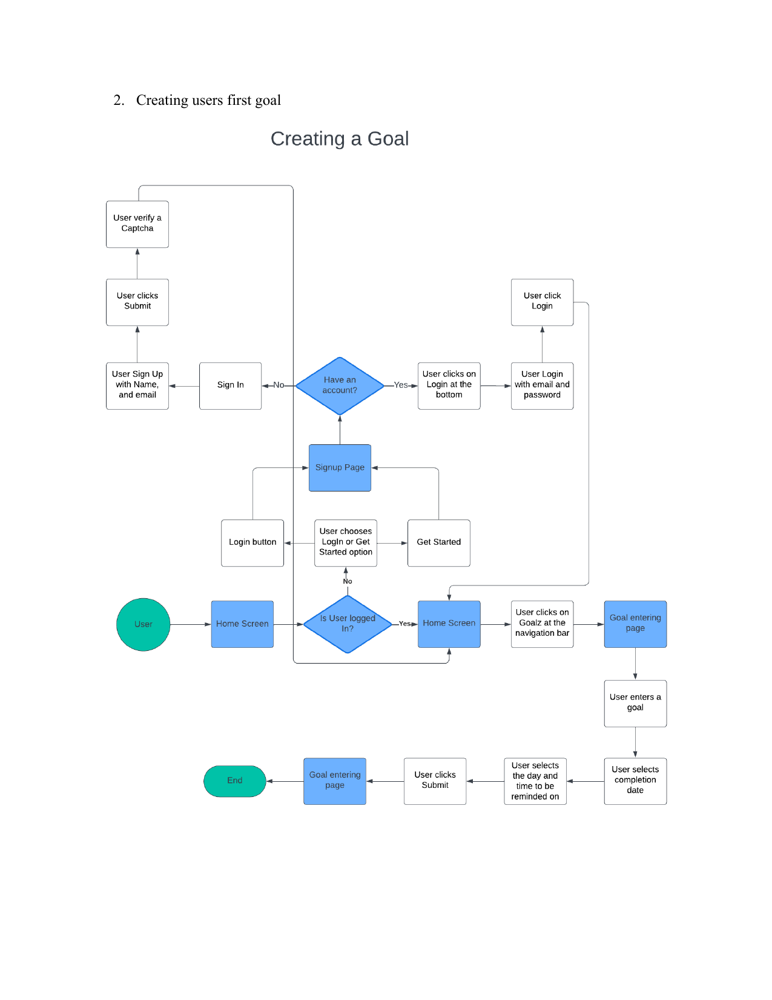
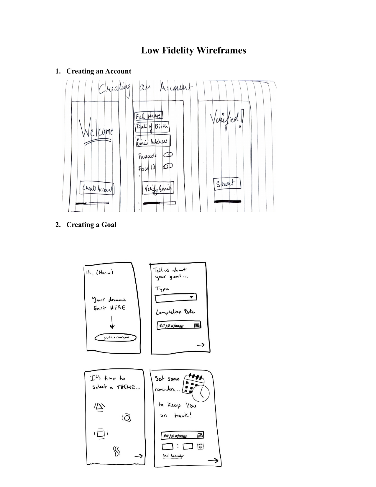
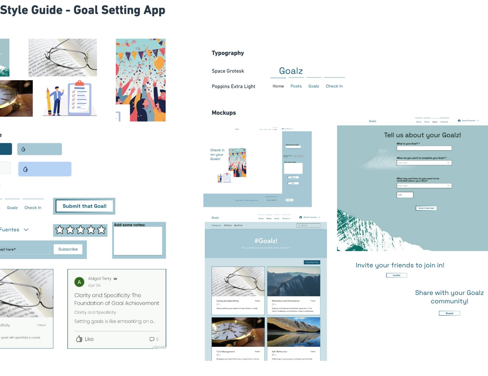
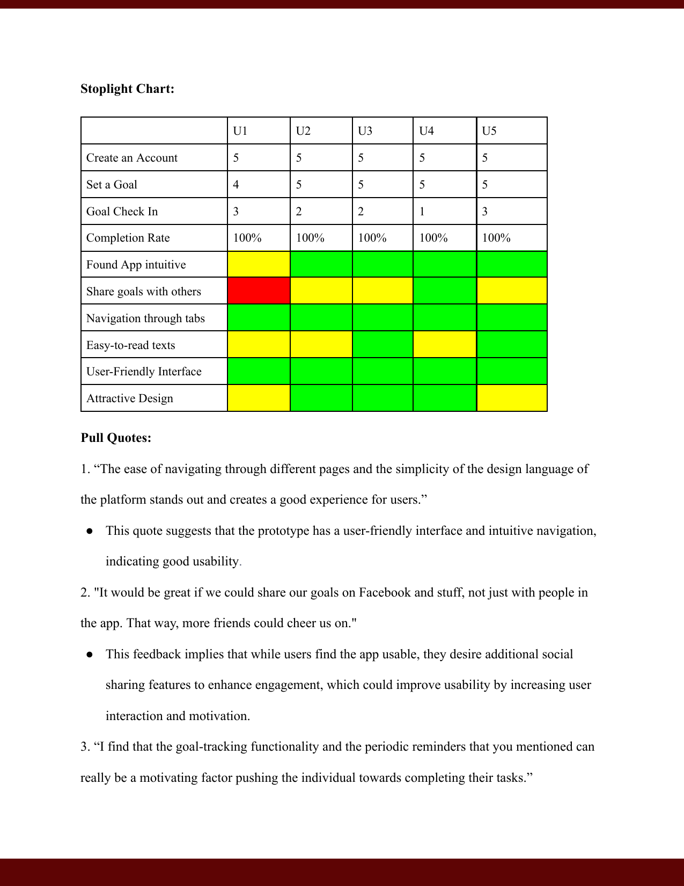
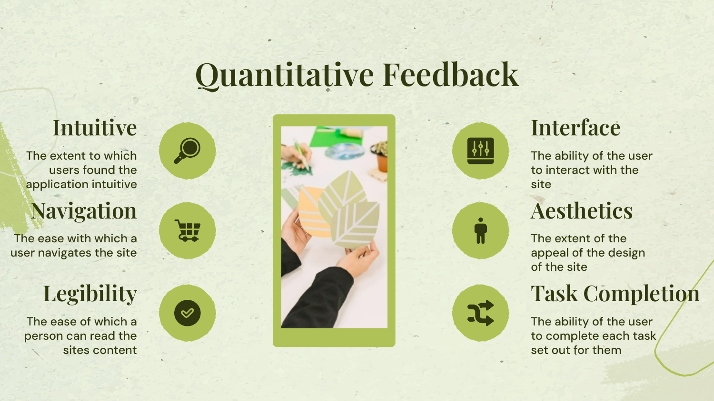
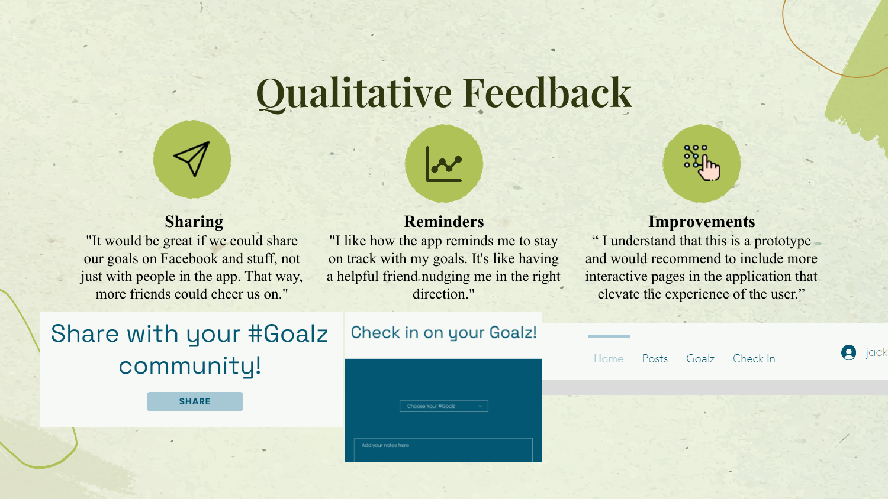
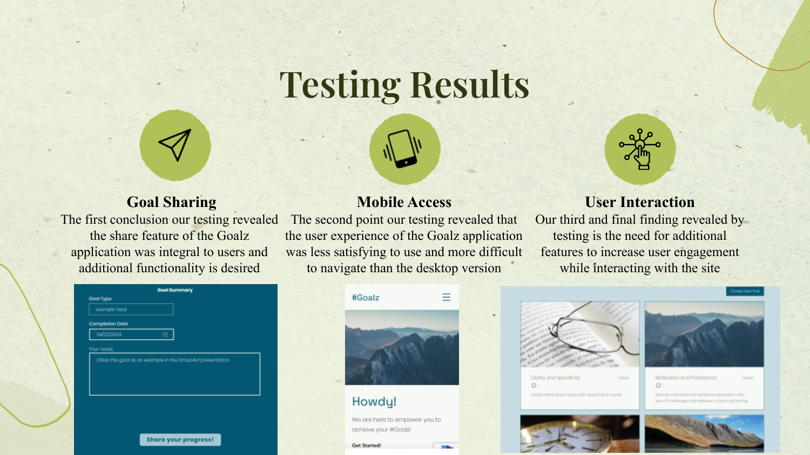

# 🎯 AimAssist — Goal-Tracking App

### A UX case study for a goal-setting and accountability web app, designed to help college students set goals, stay accountable, and celebrate progress with a supportive community.

<p>
  
  
  
  
</p>

**🔗 Live working prototype:**
[**Try AimAssist (Goalz) →**](https://abbyt06.wixsite.com/goalz)

> No install required — the link opens the working high‑fidelity web app prototype. Create an account, set a goal, and check in on your progress just like a real user would.

---

## 📖 Table of Contents

- [Overview](#-overview)
- [Problem Statement](#-problem-statement)
- [Meet the User](#-meet-the-user)
- [Design Process](#-design-process)
  - [1. Competitive Research](#1-competitive-research)
  - [2. User Journey Mapping](#2-user-journey-mapping)
  - [3. Task Flows & User Flows](#3-task-flows--user-flows)
  - [4. Wireframes](#4-wireframes)
  - [5. Style Guide](#5-style-guide)
  - [6. Usability Testing](#6-usability-testing)
  - [7. User Stories & Prioritization](#7-user-stories--prioritization)
- [Key Findings & Iterations](#-key-findings--iterations)
- [Screenshots](#-screenshots)
- [Repository Structure](#-repository-structure)
- [How to Try the Prototype](#-how-to-try-the-prototype)
- [Tools Used](#-tools-used)
- [Team](#-team)
- [Team Reflection](#-team-reflection)

---

## 🌱 Overview

**AimAssist** (originally prototyped as **"Goalz"**) is a goal‑setting and accountability web application designed for busy, dedicated college students. It gives users a simple way to set personal and academic goals, get reminders to stay on track, check in on their progress, and share wins with a supportive community — turning solitary goal‑setting into a more social, sustained habit.

This repository documents the **full UX design process** behind AimAssist: the problem framing, persona development, competitive research, user journey mapping, task and user flows, low‑ and mid‑fidelity wireframes, a style guide, and a full round of usability testing — culminating in a working high‑fidelity prototype.

This project was completed as coursework for **ISTM 631** by a five‑person team.

---

## 🎯 Problem Statement

> "As a dedicated college student, I want a way to be held accountable for my goals, so that I can become a more disciplined and successful person."

**How Might We:**
> How might we provide a way for dedicated college students to be more disciplined and successful?

---

## 👩‍🎓 Meet the User

**Charlotte Smith** — 23, College Student at Texas A&M University (Environmental Sciences)

| | |
|---|---|
| **Traits** | Hard‑Working · Tech‑Savvy · Adaptable |
| **Interests** | Photography · Journaling · Reading |
| **Apps she uses** | Libby, Quizlet, Grammarly, Trello, Duolingo |

**Goals:** Pursuing continuous self‑improvement · Upholding her personal values and faith · Collaborating effectively in team settings

**Challenges:** Struggles with perfectionist tendencies · Managing diverse perspectives on excellence · Establishing and maintaining personal accountability

> Charlotte is dedicated to both academia and her community. She's highly ambitious and determined to make a lasting impact — but like many students, she needs a system that keeps her goals visible and her progress honest.

---

## 🔍 Design Process

### 1. Competitive Research

Before designing new screens, the team looked at how existing tools handle goal‑tracking, accountability, and collaboration — pulling specific interaction patterns worth borrowing:

- **Google Play goal/habit tracker apps** → a cohesive dashboard giving users an overview of goals, deadlines, and progress at a glance
- **Todoist** → a simple, intuitive goal‑entry form (due date, priority, reminders)
- **Hive (project management)** → an encouraging progress bar that visualizes accomplishment toward a goal
- **Slack** → logical bucketing/segmenting of content via channels, informing how goals could be organized
- **Google Keep** → lightweight sharing/collaboration on shared tasks
- **LinkedIn Learning "My Goals"** → a weekly summary/history view of accomplishments and progress

These patterns directly shaped AimAssist's dashboard, goal‑entry form, progress bar, and check‑in history features.

### 2. User Journey Mapping

A weekly journey map was built around Charlotte's academic life to identify where accountability tools could help most:

| Day | Focus | Key Pain Point |
|---|---|---|
| Monday | Setting Goals | Overwhelmed by number of goals; hard to prioritize |
| Tuesday | Attending Classes | Struggling to stay focused during long lectures |
| Wednesday | Study Sessions | Difficulty managing time across commitments |
| Thursday | Seeking Feedback | Anxious about receiving and applying feedback |
| Friday | Reflecting on Progress | Hard to accurately evaluate progress |
| Sat/Sun | Balancing Work & Rest | Guilt around taking breaks and prioritizing self‑care |

This map surfaced the recurring need for **structured goal check‑ins**, **reminders**, and **self‑reflection prompts** — all of which became core AimAssist features.

### 3. Task Flows & User Flows

Three core flows were mapped in detail, from task‑level steps down to full decision‑branch user flows (including login state, CAPTCHA verification, and returning users):

**Creating an Account:** Open app → navigate to account page → complete new user form → click "Submit" → confirmation email sent

**Creating a Goal:** Click "Goalz" in navigation → enter goal type → select completion date → select reminder date/time → confirm goal creation

**Goal Check‑In:** Click "Check In" in navigation → select the goal to check in on → update progress bar → add notes/updates → post with selected privacy setting

### 4. Wireframes

**Low‑fidelity** hand‑sketches were used to rapidly test the three core flows (account creation, goal creation, check‑in) before any visual design was applied — covering welcome/sign‑up, goal type & completion date, theme selection, and reminders.

**Mid‑fidelity** wireframes translated those sketches into structured screens with consistent components, progress indicators, and clearer hierarchy — including new steps discovered during design, like inviting friends to join and a final "there's no going back" confirmation before goal creation.

### 5. Style Guide

A dedicated style guide defined the product's visual language ahead of high‑fidelity design:

- **Typography:** Space Grotesk (headings/logo), Poppins Extra Light (navigation & body)
- **Navigation labels:** Home · Posts · Goalz · Check In
- **Core components:** goal‑entry form ("Tell us about your Goalz!"), star‑rating check‑ins, note fields, "Invite your friends to join in!" and community sharing modules
- **Community feature:** a **#Goalz** feed where users can post and follow topics like *Clarity and Specificity* and *Motivation and Persistence*

### 6. Usability Testing

**Test plan:** 3 sequential tasks — create a new user account, create a goal, complete a goal check‑in — run with young‑to‑middle‑aged adults across both mobile and desktop delivery. Pull quotes and satisfaction scores (5‑point Likert scale) were collected during and after each session.

**Metrics evaluated:** Intuitiveness, Navigation, Legibility, Interface, Aesthetics, and Task Completion.

**Stoplight chart results (5 users, U1–U5):**

| Task | U1 | U2 | U3 | U4 | U5 |
|---|---|---|---|---|---|
| Create an Account | 5 | 5 | 5 | 5 | 5 |
| Set a Goal | 4 | 5 | 5 | 5 | 5 |
| Goal Check In | 3 | 2 | 2 | 1 | 3 |
| Completion Rate | 100% | 100% | 100% | 100% | 100% |

Every participant completed all three tasks (**100% completion rate**), and the app was consistently rated as having a **user‑friendly interface and easy navigation**. **Goal sharing** was the one area users consistently scored lower and asked to see improved.

**Representative user quotes:**
- *"The ease of navigating through different pages and the simplicity of the design language of the platform stands out and creates a good experience for users."*
- *"It would be great if we could share our goals on Facebook and stuff, not just with people in the app. That way, more friends could cheer us on."*
- *"I like how the app reminds me to stay on track with my goals. It's like having a helpful friend nudging me in the right direction."*
- *"I found the goal check‑in useful because I often lose focus or fail to hold myself accountable long term."*
- *"I think that the mobile version could probably use some improvements."*

### 7. User Stories & Prioritization

User stories were grouped into two epics and prioritized using **MoSCoW**:

**Epic 1 — Supporting continuous efforts** (goal check‑in, reminders, progress, coaching, motivation)
**Epic 2 — Enabling collaboration & peer accountability** (goal sharing, community posts)

| Priority | User Story |
|---|---|
| **Must Have** | Goal check‑in / reminders so users don't lose focus on long‑term goals |
| **Must Have** | Goal check‑in / progress so personal goals don't become afterthoughts to academic ones |
| **Must Have** | Goal‑sharing feature so group members stay aligned on deliverable progress |
| **Should Have** | Motivational quotes/tips alongside reminders to stay inspired |
| **Could Have** | Goal sharing / community posts to see peers' accomplishments and rejuvenate motivation |
| **Won't Have** | Personalized coaching or mentorship services |

---

## 💡 Key Findings & Iterations

Testing surfaced three consistent themes, which directly shaped the final high‑fidelity build:

1. **Goal Sharing** — the share feature was integral to users, who wanted broader functionality (e.g., sharing outside the app, like to Facebook)
2. **Mobile Access** — the mobile experience was less satisfying and harder to navigate than desktop
3. **User Interaction** — users wanted additional features to increase engagement while using the site

**Changes made to the high‑fidelity web app in response:**
- Improved text/button color contrast for readability
- Removed social media icons that caused confusion
- Removed the email‑client share option to streamline the sharing journey
- Adjusted backgrounds to fix text legibility issues and swapped in more relevant imagery
- Refined text box labels for clarity
- Redesigned the goal check‑in layout to prioritize intuitiveness
- Dropped the "#" from the product name so it reads cleanly across social platforms (Goalz)

---

## 🖼️ Screenshots

> Place the exported images (included alongside this README) into an `assets/screenshots/` folder at the root of your repo, then these will render automatically on GitHub.

### Persona


### User Journey Map


### Competitive Research


### User Flows
| Creating an Account | Creating a Goal | Goal Check‑In |
|---|---|---|
|  |  |  |

### Low‑Fidelity Wireframes
| Account & Goal Creation | Goal Check‑In |
|---|---|
|  |  |

### Mid‑Fidelity Wireframes
| Account Creation | Goal Creation & Check‑In |
|---|---|
|  |  |

### Style Guide


### Usability Testing
| Stoplight Chart & Pull Quotes | Quantitative Metrics | Qualitative Feedback |
|---|---|---|
|  |  |  |



---

## 📁 Repository Structure

```
aimassist-goal-tracking-app/
├── README.md
├── assets/
│   └── screenshots/
│       ├── persona-charlotte-smith.png
│       ├── user-journey-map.png
│       ├── competitive-research-lightning-demo.png
│       ├── user-flow-creating-account.png
│       ├── user-flow-creating-goal.png
│       ├── user-flow-goal-checkin.png
│       ├── low-fi-account-goal-creation.png
│       ├── low-fi-goal-checkin.png
│       ├── mid-fi-account-creation.png
│       ├── mid-fi-goal-creation-checkin.png
│       ├── style-guide.png
│       ├── testing-stoplight-chart.png
│       ├── quant-feedback-metrics.png
│       ├── qual-feedback-quotes.png
│       └── testing-results-summary.png
├── docs/
│   ├── Project-Portfolio.pdf
│   ├── Presentation-Deck.pdf
│   ├── Task-Flows.pdf
│   ├── User-Flows.pdf
│   ├── Low-Fidelity-Wireframes.pdf
│   ├── Mid-Fidelity-Wireframes.pdf
│   ├── Style-Guide.pdf
│   ├── Persona.pdf
│   ├── Journey-Map.pdf
│   └── Competitive-Research.pdf
```

---

## 🧪 How to Try the Prototype

1. Click the **[live prototype link](https://abbyt06.wixsite.com/goalz)** above.
2. Create an account (or click "Get Started") to enter the app.
3. Set your first goal — choose a type, completion date, and reminder.
4. Visit **Check In** to update your progress, add notes, and share with the #Goalz community.

---

## 🛠️ Tools Used

- **Wix** — high‑fidelity, functional web app build
- **Figma** — mid‑fidelity wireframing
- **Paper sketching** — low‑fidelity wireframes
- **Draw.io / flowchart tooling** — task flows & user flows
- **Google Forms** — usability test surveys (5‑point Likert scale)

---

## 👥 Team

**Group 4 U!** — Abby Terry, Daniel Fuentes, Jack Gsanger, Tanmay Kakkad, Pratyush Saxena
*ISTM 631: 601*

---

## 🪞 Team Reflection

The team's biggest strength was a genuinely conflict‑free, collaborative working environment — diverse skill sets and comfort sharing ideas fueled creativity, especially during the app‑creation stages. The main areas identified for growth were **communication** (occasional breakdowns led to misunderstandings), **time management** (better prioritization was needed to hit deadlines), and **refining collaborative tools/processes** to improve overall efficiency.
